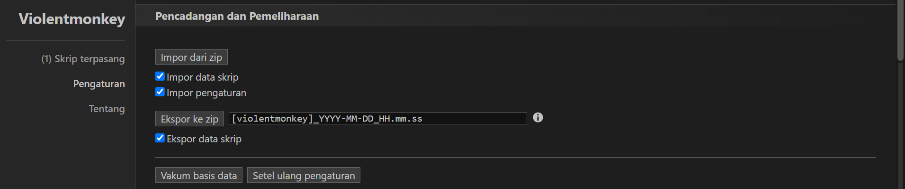

---

<h1 align="center">Capital City Extension Bot</h1>

Otomatisasikan tugas-tugas di Capital City untuk memaksimalkan efisiensi permainanmu dan memberikan pengalaman bermain yang lebih optimal!

---

## 🚀 **Tentang Extension**

**Capital City Extension Bot** dirancang untuk mengotomatisasi berbagai tugas di [Capital City](https://capitalcity.web.id/), termasuk:

- **Auto Playing Game Rat Hunter**: Memainkan game rat hunter secara otomatis.
- **Auto Playing Game Treasure Hunter**: Untuk fitur ini, kamu perlu membuka game treasure hunter, me-refresh key, kemudian jalankan fitur ini.
- **Regen Kesehatan**: Memulihkan kesehatan karaktermu secara otomatis.
- **Regen Energy**: Mengembalikan energy secara otomatis (butuh cash 200 untuk menjalankan fitur ini).

Extension ini membantu kamu menghemat waktu dan fokus pada keseruan permainan dengan mengotomatiskan tugas-tugas berulang.

---

## 🌟 **Versi v1.0.0**

### **Pembaruan**

- **Rilis Awal**: Fitur otomatisasi lengkap untuk game rat hunter, game treasure hunter, regen kesehatan, dan regen energy.

### **Pembaruan Selanjutnya**

- Penjelasan yang lebih mendetail mengenai cara penggunaan tiap fitur.
- Optimalisasi fitur-fitur yang sudah ada.
- Penambahan fitur-fitur baru yang mendukung gameplay.

Tetap pantau untuk update selanjutnya!

---

### **Fitur pada Versi Ini**:

- **Auto Playing Game Rat Hunter**: Menjalankan game rat hunter secara otomatis.
- **Auto Playing Game Treasure Hunter**:  
  *Catatan: Untuk menggunakan fitur ini, buka game treasure hunter, refresh key, dan jalankan fitur secara otomatis.*
- **Regen Kesehatan**: Memulihkan kesehatan karaktermu secara otomatis.
- **Regen Energy**: Mengembalikan energy (dengan syarat memiliki cash 200).

---

## 📖 **Langkah-langkah Instalasi**

Ikuti langkah-langkah berikut untuk menginstal Capital City Extension Bot:

1. **Instal Violent Monkey**  
   Unduh dan instal ekstensi Violent Monkey melalui Chrome Web Store:  
   [Violent Monkey on Chrome Web Store](https://chromewebstore.google.com/detail/violentmonkey/jinjaccalgkegednnccohejagnlnfdag)

2. **Unduh Extension**  
   Unduh file ZIP dari repository GitHub.

3. **Impor Extension**  
   - Klik ikon **Violent Monkey** di browser kamu.
   - Klik ikon **roda gigi (settings)**.
   - Gulir ke bagian bawah.
   - Klik tombol **Import**.
   - Pilih dan impor file ZIP yang sudah diunduh.  
     Contoh:
     

4. **Nikmati Extension**  
   Setelah diimpor, extension siap untuk meningkatkan pengalaman bermainmu di [Capital City](https://capitalcity.web.id/).

---

## 🛠️ **Berkontribusi**

Proyek ini dikembangkan oleh **LIVEXORDS**. Jika kamu memiliki saran, pertanyaan, atau ingin berkontribusi, jangan ragu untuk menghubungi:

  

---
